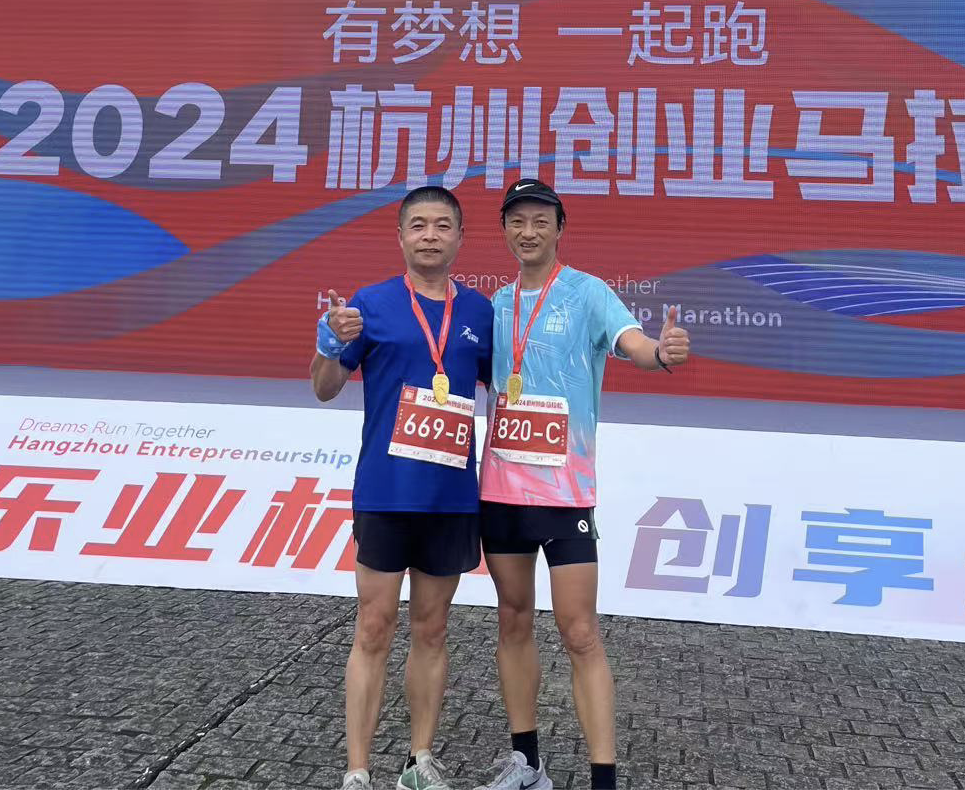
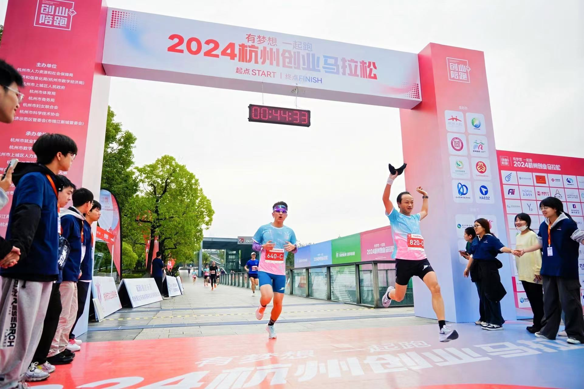
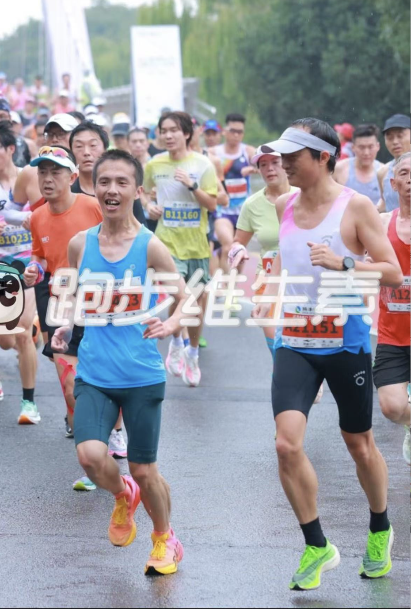
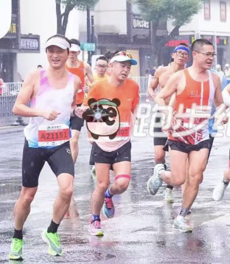
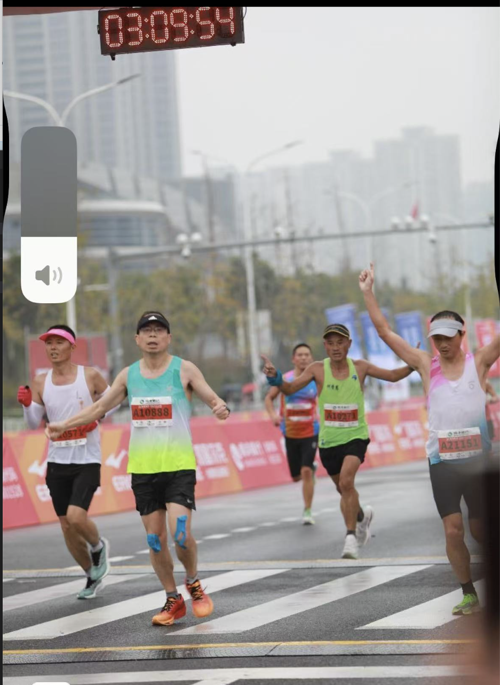
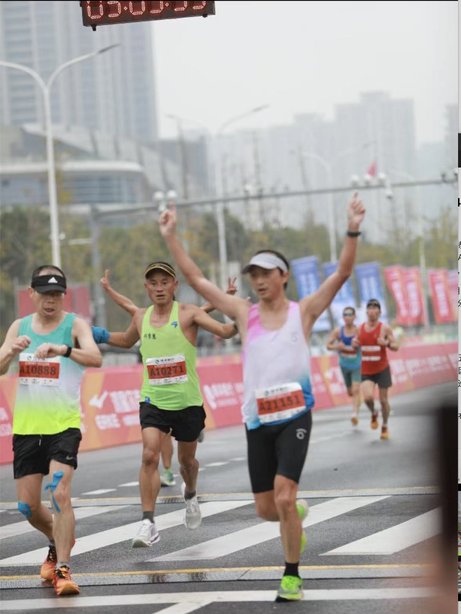

### 绍兴马拉松小记（2024-11-10，全马PB 3:09:12）

#### 一、成绩
【极峰计时】尊敬的夏炜：恭喜您完成瑞丰银行·2024绍兴马拉松。项目：马拉松，您的参赛号为A21151，枪时成绩03:09:54，净时成绩03:09:12。此成绩仅供参考，最终成绩请以官网公布为准。

过去最好成绩是2019年11月10日的绍兴马拉松，当时的成绩是3:16:20，这次足足提升了7分7秒。5年了，同一天，同一个地方，再次PB。这次夏训成果满满的。

#### 二、赛前
为了准备绍兴马拉松，从周五开始休息，周六有一个创业马拉松，因为没考虑拿成绩，完赛即可，因此也计划4:50配速随便跑。并且还联系了落叶雨，一起计划4:30配速巡航完成绍兴马拉松，这样就能完成我破3:15:00的目标了。

  
        **老顾**

周六创业马拉松赛场上，只有10km的距离，一开始就跑的比较轻松。在8km的时候碰到良渚跑团的老顾，一起以430的配速跑起来。到了最后1公里的时候，有点压抑不住自己，冲了起来。一路赶超其他跑者，真是开心。最后200米有一段下坡，更是兴奋的以冲刺的速度和旁边的跑友比拼了起来。这一次200米的全力冲刺，跑完就后悔了，感觉自己腿有点拉伤。下午开车去绍兴拿参赛包的时候，腿还隐隐做痛。晚上回到杭州，马上就睡了。

  
      **发疯**

落叶雨在晚上给我发来消息，说感冒还没好，可能要弃赛了。这种时候不能强求，也安慰了一下，健康最重要，也劝他弃赛。

计划了很久的马拉松，跑前拉伤了，跑友弃赛了。赛前还看了天气，气温17-18度，有小雨。一切都好似在和我作对。

#### 三、比赛经历

早上3点半的闹钟叫醒了我，做好了正常的赛前准备后，5点钟准时和左大神一起开车去了绍兴。路上一路聊着我碰到的这些糟心事。一边计划着安全完赛就好，目标330。毕竟自己后面还有3个A1级别的赛事，后面再完成今年的PB目标也可以的。

绍兴的天气还不错，早上并没有天气预报的下雨。挤到了A2赛区的最前面，A1区的人数并不多。这时似乎又有信心了。

开跑后状态良好，起跑速度基本维持在420左右。腿伤有点疼起来，心中一直警告自己，不能加速了，压住！压住！跑了8公里的时候受伤的地方感觉跑开了，腿上没啥不适了。但心中一想，后面的路程还很长，自己一个人很有可能压不住配速。并且跑了8公里了，周围应该都是差不多配速的人，于是物色周围有没有合适一起跑步的跑友。

面前跑着一个精瘦的跑者，一看就是很有经验的样子，就跟他聊了起来。

“今天准备怎么跑？我420-430配速，要不要一起？”

他看了我一眼，同意了。

但内心他是想跑更好成绩了。一起跑了不到100米，就加速离开了。
 
 
   **精瘦的跑者**

这时我后面一个大哥说，我今天感冒了。不跑成绩，一起吧，我欣然接受了，不管是谁，能一起跑，一起控配速挺好的。另外一个小哥也和我们搭起话来，谦虚的说，我跟先你们20公里，后面可能就跟不上了。于是三人组合形成。

 
   **三人组合**

跑步的时候，跟大哥聊了起来，他是余姚人，并且是一个妥妥的跑步大神，各大赛事都破三破过了，对破三看的很淡，还做过多次兔子，配速很稳，上周也跑了杭马，今天同样感冒了，安全完赛即可，跑的也很佛系。

在我们三人组合形成后，速度降到了430。我开始相对轻松的跑了起来。一路互相聊天，看到能量胶补给，大哥抓了一大把，分给我们两个，还分给周围的跑友。一路上我带的4个能量胶，只吃了一个，剩下的都是路上补给点拿的。

大神就是大神，路上认识的跑友真多，一路有拍肩的，打招呼的，真热闹。其他时间我们聊天，加油鼓励，共同控制配速。时间不知不觉就过去了，来到了25公里的时候大神碰到了熟人，就慢下来和熟人聊天，让我们加速。不用等他，于是我们三人组合解散了，大家各自为战。

因为前面轻松的状态。我决定加点速度，配速提升到了4:20，一路观察有没有认识的好友。在折返点看到了离我不算太远的小哥和大神。原来他们也就在我后面3-400米样子，还在折返的的对面看到了网红唐小芬，也看到了临平网红光头大叔。

三十公里的地方到了，一看表，2小时13分，心算了一下，好像跑进310没有啥问题，再加上腿又开始隐约作痛，于是又放慢了脚步，降配速到430。35公里的时候再一看时间，2小时35分，还有7公里，每公里5分配也可以进310，更是放心了。继续降速，保证腿部疼痛不加重的情况下在430-450之间跑即可。

41公里的标牌下，手表显示3小时04分，哈哈，310稳了，心情放松了许多。路上一个小哥在这时走了起来，我还鼓励的喊了声：“加油，快到了！”。42标牌点手表显示3小时08分多。还有200米，远远的可以看到官方计时牌还没到3:10,我还可能在官方计时牌310前到终点，最后还稍微加了一点速度，举起双手，摆好表情，胜利一样的冲过终点，希望有摄影大哥捕捉到我。3:09:54，冲过终点的照片。
 
 
    **冲刺照片**

#### 四、赛后总结
1. 比赛中有合适配速的跑友，稳住配速是关键，没有前面那十多公里的430轻松跑。可能很早腿伤就爆发了，后面只能跑崩。前8公里的420配速，心率只有150左右，后面25-30的420配速，心率就提升到了158左右，同样的配速后程心率会高。
2. 天气很好，小阵雨，刚好降温，感觉出汗不严重，路上补水不算太多，盐丸也只补了两颗。
3. 心态好，赛前就知道自己430配速算比较轻松的，但420全程可能扛不下来，因此果断明确自己配速430即可，不盲目加速。
4. 今年科学和严格的夏训才是这次PB的最重大功臣。有了跑量的堆积，有了多次的LSD，有了一次次的间歇跑、节奏跑，有了赛前的各种自测。进步是看得见的，感受得到的，对自己的能力把握也非常准确。
5. 最后就是跑废一双最贵的跑鞋，有点心疼。但这双鞋也算功德圆满，临安半马 PB 6分钟和这次全马 PB 7分钟，穿的都是它。

跑的很开心，认识了新朋友，感受了赛道，也感受了绍兴人的热情，一路和路边的人喊加油，还大幅PB了。明年绍兴再见！我的福地！

最后，科学的跑步、健康的跑步，无伤的跑步才是王道。愿跑友们都能做到无伤跑，健康跑，跑到老！！！